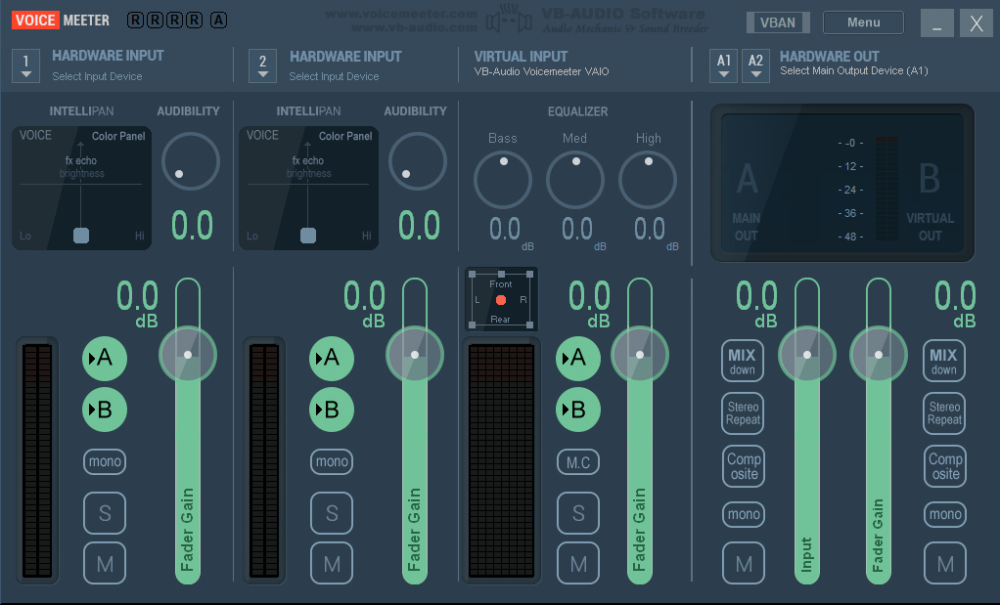
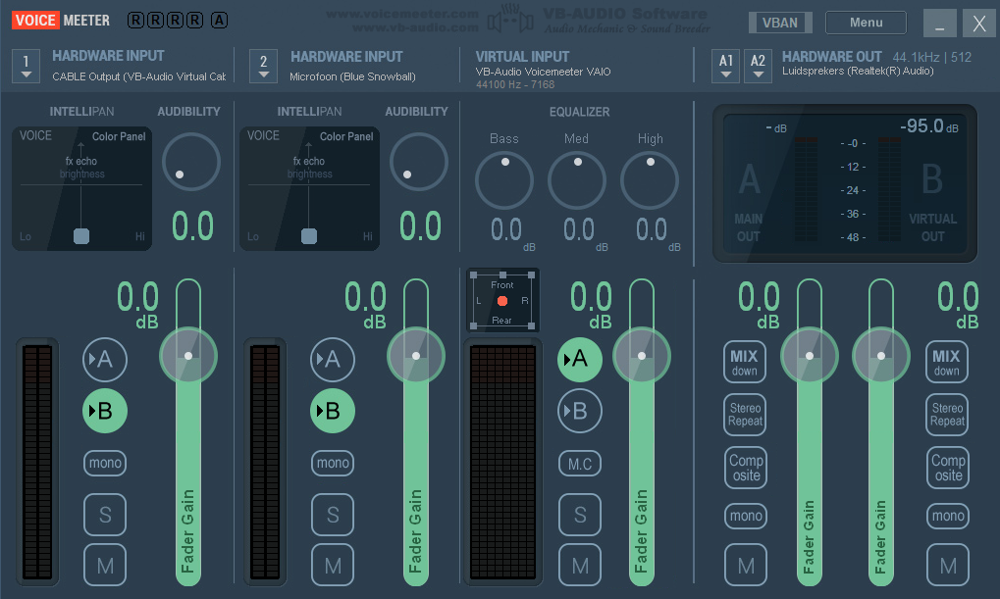
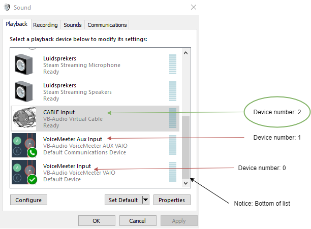

# TF2 Chat To Speech


### FAQ


| Question                                                     | Answer                                                       |
| ------------------------------------------------------------ | ------------------------------------------------------------ |
| *Question*: Does this run on any other platform than Windows? | *Short answer*: No. This project was made as a windows alternative to a **Linux and OSX** Text To Speech script: [Sophie's Linux Text To Speech](https://steamcommunity.com/sharedfiles/filedetails/?id=1747696293). Fun fact: This project was inspired by Sophie :)<br /><br />*Long answer*: This project targets .NET framework instead of .NET Core in order to access the VoiceSynthesizer package. Got an alternative which works with .NET Core? Feel free to contact me/make an issue/pull request! |
| *Question*: Is this bannable by VAC?                         | No. The only interaction between this program and Team Fortress 2 is the reading of a .log file. |


### Requirements:

- Windows 7 or higher,
- [VB-Virtual Audio Cable](https://vb-audio.com/Cable/index.htm) (Free)
- (These programs are **optional**, see "how to install") [VoiceMeeter](https://vb-audio.com/Voicemeeter/index.htm) (Free/donationware, basic. This version is featured in the install tutorial) OR [VoiceMeeter Banana](https://vb-audio.com/Voicemeeter/banana.htm) (Free/donationware, for advanced users)
- Team Fortress 2.


### How To Install:

This tutorial is split into two versions. Decide on your own which one is best for you:

| Basic Installation                                           | Advanced Installation                                        |
| :----------------------------------------------------------- | :----------------------------------------------------------- |
| + Quick and easy                                             | - Takes longer to install                                    |
| + Only needs VB-Virtual Audio Cable                          | - Needs VB-Virtual Audio Cable AND VoiceMeeter               |
| - Cannot use microphone in-game whilst using <br />TF2Chat To Speech (Discord, Skype, etc. still possible) | + Can use microphone in-game whilst using TF2Chat To Speech  |
| + Does not interfere with normal audio use                   | - Overrides default audio devices. In order to listen to any <br />kind of sound on your computer, you need to open VoiceMeeter! |


###### Step 1: Team Fortress 2


Download `tf_files.zip` from the most recent release from the [releases page](https://github.com/Joey-Einerhand/TF2ChatToSpeech/releases).

Unpack the *contents* from `tf_files.zip` into your `steamapps\common\Team Fortress 2\tf` folder.

Go to your `steamapps\common\Team Fortress 2\tf\cfg` folder. If an `autoexec.cfg` doesn't exist, create one.

Open your `autoexec.cfg` file with your text editor of choice. I recommend [Notepad++](https://notepad-plus-plus.org/downloads/).

Add the following to the bottom of your `autoexec.cfg` file:

```
// Press "V" to toggle open-mic
exec toggleopenvoice
exec tf2chattospeech
```

The `tf2autotalk` overwrites the `v` TF2 key binding. You can change which key you'd like to use in the `tf2autotalk.cfg` file.

Continue to step 2a if you'd like to do a basic installation. Continue to step 2b if you'd like to do an advanced installation.


###### Step 2a: Basic Installation

Download [VB-Virtual Audio Cable](https://vb-audio.com/Cable/index.htm) (Free) and install it

Open steam and click on "friends and chat". Open your friends list settings (The clog). Navigate to Voice settings and change "Voice Input Device" to `CABLE Output`

Continue to step 3.


###### Step 2b: Advanced Installation

Download and install [VB-Virtual Audio Cable](https://vb-audio.com/Cable/index.htm) and [VoiceMeeter](https://vb-audio.com/Voicemeeter/index.htm) (This step assumes you've installed the default, non-banana version). 

Press the windows key and search for "Sound Settings". After opening this window, click on "Sound Control Panel". (Alternatively, right click on the speaker icon in your task bar, click on "Open Sound Settings", and open "Sound control panel").

Under the "Playback" tab, scroll down until you see your default playback device. You can see whether a device is default by looking for a green checkmark Remember this device, you're going to need it when configuring VoiceMeeter.

Scroll down until you see two "VoiceMeeter" input devices. Select `VoiceMeeter Input` and set it to default by clicking "Set Default". Select `VoiceMeeter Aux Input`, click on the arrow next to 'Set default' and click on the "Default communications device" option. If you do not have `VoiceMeeter Aux Input`, don't change your default communications device.

Under the "Input" tab, repeat the previous step but with `VoiceMeeter Output` and `VoiceMeeter Aux Output` instead of the `input` devices.

Click on "apply" and close the window.

Open VoiceMeeter. It should look something like this:



Note that the text beneath "Virtual Input" might differ from the image. This is okay.

From left to right:

* Underneath "1 Hardware input", click on "select input device" and select `WDM: CABLE Output`. If you can't see this device, be sure you have VB-Virtual Audio Cable installed.
* If you have a microphone and wish to use it, underneath "2 Hardware input", click on "select input device" and select your microphone device. Mine is `WDM: Microfoon (Blue Snowball)`. If given a choice between `WDM` and `MME`, select `WDM`.
* Click on "Hardware Out" and select your previous default output device (This is the device I told you to remember earlier).

Under "hardware input" 1 and 2, click on the "A" button in order to disable them (they should not light up green). This disables you from hearing the output of the program directly (and your microphone, if you use one).

Under ''virtual input", click on the "B" button to disable it (It should not light up green). This prevents you from playing all incoming sounds through your microphone (For example, if you're listening to a song, or the in-game sound from Team Fortress 2).

Your VoiceMeeter should now look something like this:



Continue to step 3.


###### Step 3: Installing TF2Chat To Speech

Download `TF2ChatToSpeech.zip` from the most recent release from the [releases page](https://github.com/Joey-Einerhand/TF2ChatToSpeech/releases).

Unzip it somewhere, for example on your desktop.

Open the extracted folder.

To start TF2Chat To Speech, open `TF2ChatToSpeech.exe`. This file is located in the folder you just extracted.

The program will ask you if you want to load any previous settings. Press `n`.

The program will now ask you to input the output device number of your CABLE Input. 

In order to determine the right number for you, press the windows key and search for "Sound Settings". After opening this window, click on "Sound Control Panel". (Alternatively, right click on the speaker icon in your task bar, click on "Sound Settings", and open "Sound control panel").

Under the "Playback" tab, scroll down until you see the CABLE Input device. In order to determine it's number, count up from 0, starting at the bottom of your devices list. Like so:



The devices listed under playback tab might be different from yours. For example, if you did the basic installation (Step 2a) you would not have the VoiceMeeter devices installed.

In my case, I'd select input "2" as my device number. After inserting your device number, press enter.

Afterwards, the program will ask you to specify a path to your `Team Fortress 2\tf` folder. This folder is located in `C:\Program Files (x86)\Steam\steamapps\common\Team Fortress 2\tf` by default, but this might not be the case if you've installed Steam or Team Fortress 2 in a different location. Press enter once you've put in the correct file path.

The program will now ask you for the name of the file which your tf2 console outputs to. By default, this is `tf2consoleoutput.log`. To change this, edit `tf2chattospeech.cfg` in your `Team Fortress 2\cfg` folder.

If no error appears, it means you've successfully set up TF2Chat To Speech. Next time you open the program, you can press "y" to load the settings you've just entered.


Congratulations, you're done! Hop into a match of TF2, press `v` (or the key you've specified in `toggleopenvoice.cfg`) and play!

Don't forget, if you've done Step 2b Advanced installation, you need to open VoiceMeeter in order for TF2Chat To Speech to work!


### Contributing, issues, and bugs

Feel free to make a pull request if you want to contribute anything to the project.

If you're experiencing issues, bugs, or want to suggest something, feel free to make an issue on [GitHub](https://github.com/Joey-Einerhand/TF2ChatToSpeech/issues).


### Planned Features

* Add a wiki
* Add a wiki page on how to use already implemented in-game chat commands ($V0, $R5, etc)
* Add a wiki page on how to install other voices/languages
* Immigrate installation tutorial to wiki
* Add more bugs to fix later
